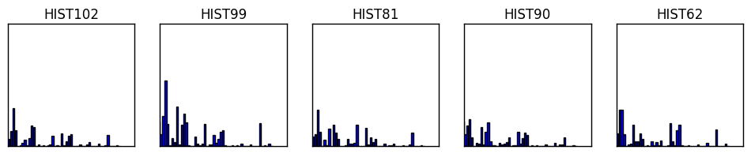

# emotion-recognition-example

Emotion recognition example using the Jaffe database

The principal library that we are going to use is Scikit Learn. I recommend the use of the Anaconda Python Distribution for everything related to scientific purposes.

```python
import os
import matplotlib.pyplot as plt
import numpy as np

from mpl_toolkits.axes_grid1 import ImageGrid
from skimage.feature import local_binary_pattern as lbp
from sklearn.neighbors import KNeighborsClassifier as KNN
from sklearn.model_selection import KFold as KF
from sklearn.model_selection import cross_val_score
```

Here we load the images, and based on the name of the file we identify the class, in this case is a number from 1 to 7 that we can find in the seventh character of the filename.

```python
data_path = '/home/nico/Workspace/Python/Jaffe/data/'
imgs = []
fs = (12, 12)

filenames = sorted(os.listdir(data_path))
d = [] # vector of classification labels

for img_name in filenames:
    img = plt.imread(data_path + img_name)
    imgs.append(img)
    d.append(int(img_name[6]))

imgs = np.asarray(imgs)
d = np.asarray(d)
indices = np.random.randint(0, len(imgs)-1, 5)
```

Here are some of the images used in this example:

```python
plt.figure(figsize=fs)

for i,im in enumerate(imgs[indices]):
    plt.subplot(1, 5, i+1)
    plt.imshow(im, cmap='gray')
    plt.xticks(())
    plt.yticks(())
    plt.title('IMG' + str(indices[i]))
plt.show()
```


This step involves the process called "feature extraction". We will use the well known LBP (Local Binary Patterns).

```python
b = [i for i in range(0,55)]
b.append(255)

lbp_imgs = []
lbp_hists = []

for im in imgs:
    aux = lbp(im, 8, 28, method='default')
    lbp_imgs.append(aux)
    
    aux2, _ = np.histogram(aux, bins=b)
    lbp_hists.append(aux2)

lbp_hists = np.asarray(lbp_hists)
```

Here we visulize the respective descriptors of the women shown before. (Observation: the last component of each histogram was ommited for visulization purposes, it was too big)


```python
plt.figure(figsize=(12,2))

for i,hist in enumerate(lbp_hists[indices]):
    plt.subplot(1, 5, i+1)
    plt.bar(b[:len(b)-2], hist[:len(hist)-1])
    plt.xticks(())
    plt.yticks(())
    plt.xlim(5)
    plt.title('HIST' + str(indices[i]))
plt.show()
```





Now we will try to predict the emotions represented in five random images training a simple classifier with the rest. The classifier that we will use is the K-Nearest Neighbor.

In this step we divide the dataset in training and testing images. This can be performed in many ways, the simplest one is K-Fold. Here we divide the images in ~30 groups (i.e, 5 images per group), this means that we train with ~140 images and test the results with the remaining 5 images. This is just an example (very straigforward, but with very poor results for the same reason), but in general it is recommended to use approximately the 70% of the data for training if you are going to use this method to group your data into training/testing sets.

```python
X = np.asarray(lbp_hists)
kf = KF(n_splits=30, shuffle=True).split(X)

train_indices, test_indices =  next(kf)

print('Training images:', train_indices, '\n')
print('Testing images:', test_indices, '\n')

X_train = X[train_indices]
y_train = d[train_indices]

X_test = X[test_indices]
y_test = d[train_indices]

knn = KNN(n_neighbors=1).fit(X_train, y_train)
class_prediction = knn.predict(X_test)

print('Predicted Classes:', class_prediction, '\n')
print('Real Classes:', d[test_indices], '\n')
```

    Training images: [0   1   2   3   4   6   7   8   9  10  11  12  13  14
      15  16  17  18 19  20  21  22  23  24  25  26  27  28  29  31  32  33
      34  35  36  37 38  39  40  41  42  43  44  45  46  47  48  49  50  51
      52  53  54  55 56  57  58  59  60  61  62  63  64  65  66  67  68  69
      70  71  72  73 74  75  76  77  78  79  80  81  82  83  84  85  87  88
      89  90  91  92 93  94  95  96  97  98  99 100 101 102 103 104 106 107
      108 109 110 111 112 113 114 115 116 117 118 119 120 121 122 123 124 125
      126 127 128 129 131 132 133 134 135 136 137 138 139 140 141 142 143 144
      145 146] 
    
    Testing images: [5  30  86 105 130] 
    
    Predicted Classes: [1 2 5 6 7] 
    
    Real Classes: [1 2 5 6 7] 
    
These results are best represented with their respective images and their predicted labels:

```python
plt.figure(figsize=fs)

for i,im in enumerate(imgs[test_indices]):
    plt.subplot(1, 5, i+1)
    plt.imshow(im, cmap='gray')
    plt.xticks(())
    plt.yticks(())
    
    emotions = np.array(['Neutral', 'Happy', 'Sad', 'Surprise', 'Disgust',
                         'Anger' , 'Fear'])
    title = str(emotions[class_prediction[i]-1])
    
    if title == str(emotions[d[test_indices][i]-1]):
        plt.title(title, color='green')
    else:
        plt.title(title, color='red')
plt.show()
```


Sometimes it is difficult even for us (humans) to identify the emotion that is supposedly being expressed. In this images if the real emotion fits the predicted one, then the title is green (right prediction), red otherwise (wrong prediction).

Finally we can make some cross validations to get a better feeling of how our classification is performing:

```python
knn = KNN(n_neighbors=1)
score_knn = cross_val_score(knn, X, d, cv=10)
print('KNN MEAN PERFORMANCE: ',str(np.mean(score_knn)*100)[:5] + '%')
```

    KNN MEAN PERFORMANCE:  63.66%

As we can see the performance is not great, but its enough for this purpose, because this is just an example. It should be noted, nevertheless, that this score can be easily improved tuning the parameters.